<p align="center">
  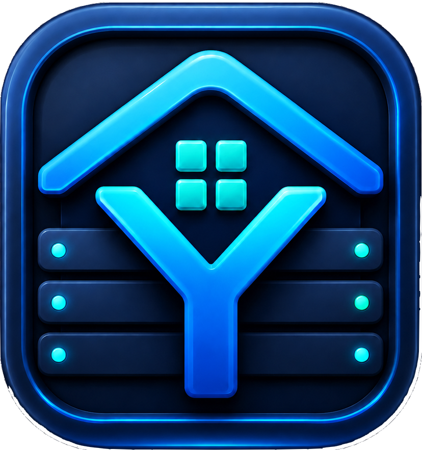
</p>

# Yoleonas

Yoleonas est une interface libre de gestion de NAS Linux. Elle rassemble dans
une interface web les fonctions courantes d'administration du serveur et
fournit des applications clientes pour surveiller et piloter le NAS.

Le moyen le plus simple de le découvrir est de télécharger l'ISO, de préparer
une clé USB et de l'essayer sur une machine de test. L'objectif du projet est
de proposer une expérience visuelle et accessible aux débutants, tout en
laissant aux utilisateurs avancés l'accès aux scripts, à Linux et à une API
documentée. Il n'est donc pas nécessaire de comprendre l'organisation du code
avant de faire un premier essai.

## Fonctions principales

- supervision du système, des disques et des services Linux ;
- gestion du stockage, de mergerfs, RAID et SnapRAID ;
- gestion des conteneurs, images, réseaux et stacks Docker ;
- partages Samba, NFS, SFTP, FTP et services multimédias ;
- gestion des utilisateurs, tâches planifiées et sauvegardes ;
- machines virtuelles libvirt et accès terminal ;
- API sécurisée utilisée par les applications clientes.

## Aperçu de Yoleo NAS OS

Les captures ci-dessous proviennent d'une installation réelle. Les noms
d'utilisateurs, adresses IP, chemins locaux, numéros de série et identifiants
propres à la machine ont été remplacés par des valeurs de démonstration.

### Tableau de bord

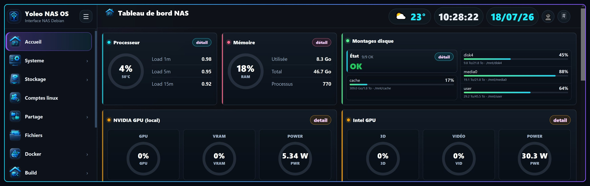

La page d'accueil donne immédiatement l'état du NAS : charge, mémoire,
températures, stockage et services essentiels. Le menu latéral regroupe les
fonctions par usage afin d'éviter de devoir administrer chaque outil depuis le
terminal.

### Stockage

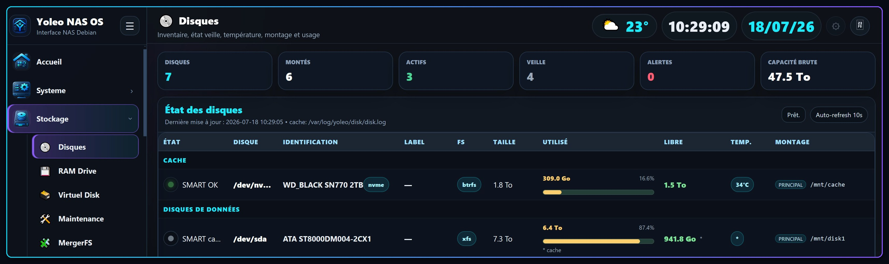

La partie stockage inventorie les disques et présente leur état. Les vues
complémentaires permettent d'examiner les identifiants matériels, puis de
construire et surveiller le pool de données utilisé par le NAS.

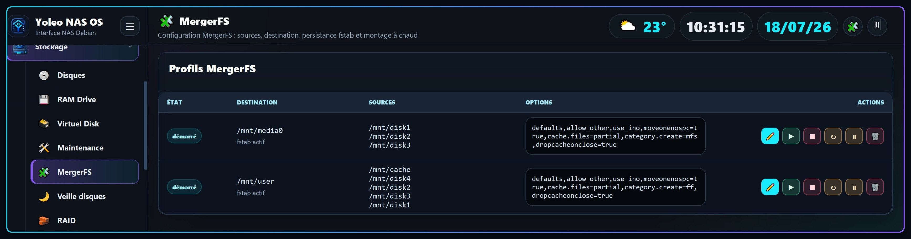

Yoleo rassemble la gestion du stockage agrégé, de mergerfs, du RAID, de
SnapRAID et des espaces temporaires en mémoire.

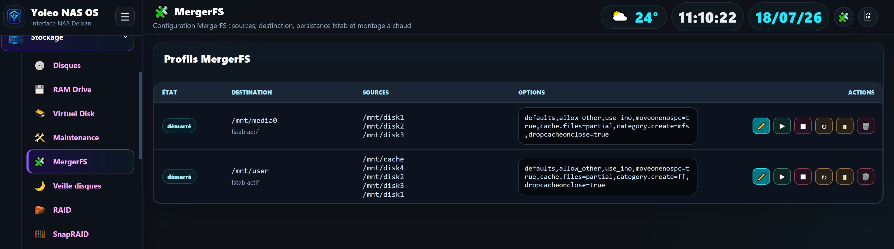

Avec **mergerfs**, plusieurs disques et dossiers restent des systèmes de
fichiers indépendants mais sont présentés aux utilisateurs et aux applications
comme un seul espace de stockage. Les données ne sont pas découpées comme dans
un RAID : la politique choisie décide sur quel disque chaque nouveau fichier
est écrit. Cette séparation permet encore d'accéder directement au contenu de
chaque disque. mergerfs n'apporte toutefois pas, à lui seul, de redondance ; une
copie, un backup ou une protection SnapRAID reste nécessaire pour protéger les
données contre la panne d'un disque.

La capture montre deux profils montés et rendus persistants dans `fstab`. Pour
chaque profil, Yoleo affiche la destination commune, la liste des disques ou
dossiers sources et les options mergerfs appliquées. Les boutons permettent de
modifier le profil, le monter ou le démonter à chaud, le redémarrer, le mettre
en pause ou le supprimer. Le profil `/mnt/user`, par exemple, rassemble le
cache et plusieurs disques derrière un chemin unique, sans effacer l'organisation
réelle des fichiers sur chaque support.

### Docker

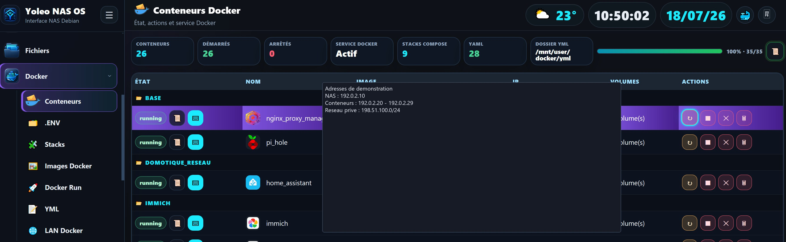

L'écran Docker centralise l'état des conteneurs et leurs actions courantes. Des
pages dédiées gèrent aussi les variables d'environnement, les stacks Compose,
les images, les fichiers YAML et le lancement de nouveaux conteneurs.

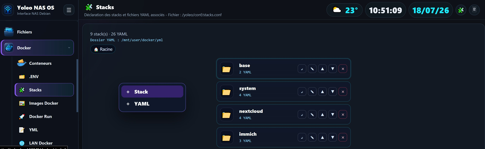

Le projet comprend également les outils nécessaires pour construire des
images et les publier dans un registre local de démonstration.

### Machines virtuelles

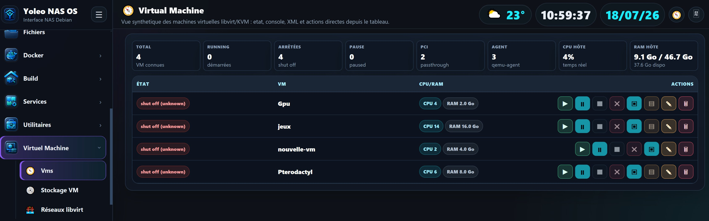

Les machines virtuelles libvirt peuvent être créées, démarrées, arrêtées et
configurées depuis l'interface. Les vues de stockage et de paramètres servent à
choisir les images disque, les ISO et les ressources attribuées à chaque VM.

### Fichiers, utilisateurs et automatisation

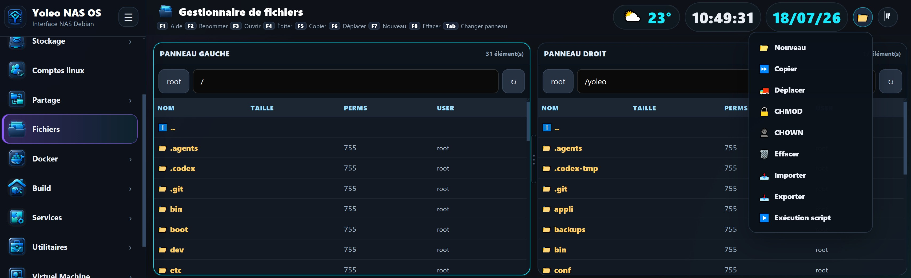

Le gestionnaire de fichiers permet de parcourir les volumes du NAS. Les autres
écrans administrent les comptes Linux et Samba, les droits, les tâches
planifiées et les scripts de sauvegarde.

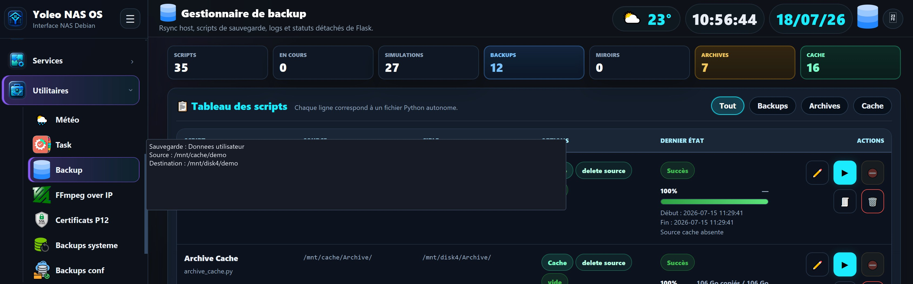

Les sauvegardes sont organisées par usages — données, archives, cache,
configuration et système — avec suivi de l'exécution et accès aux journaux.

Le moteur distingue plusieurs opérations :

- **Backup** effectue une duplication avec `rsync` vers un autre emplacement.
  Il sert à conserver une seconde copie des données, avec des options de miroir
  et de suppression de la source selon le profil choisi.
- **Archive** fabrique des fichiers datés compressés au format `tar.gz` ou
  `tar.7z`. Elle est adaptée à la conservation de versions successives et peut
  traiter une arborescence complète ou chaque dossier séparément.
- **Cache** est le nom historique du moteur de déplacement. Il déplace des
  données d'une source vers une destination selon des profils configurables ;
  il peut donc déplacer des fichiers entre deux disques même si mergerfs n'est
  pas utilisé. Ce n'est pas le cache interne de mergerfs et il reste un outil
  autonome.
- **Sauvegarde système et configuration** protège séparément les fichiers de
  Yoleo et la configuration du NAS afin de faciliter une restauration.

Les profils peuvent lancer des commandes avant et après l'opération. Cela
permet notamment d'arrêter proprement les conteneurs concernés, de copier ou
d'archiver leurs données, puis de redémarrer uniquement ceux qui fonctionnaient
avant la sauvegarde.

### Tâches planifiées et notifications

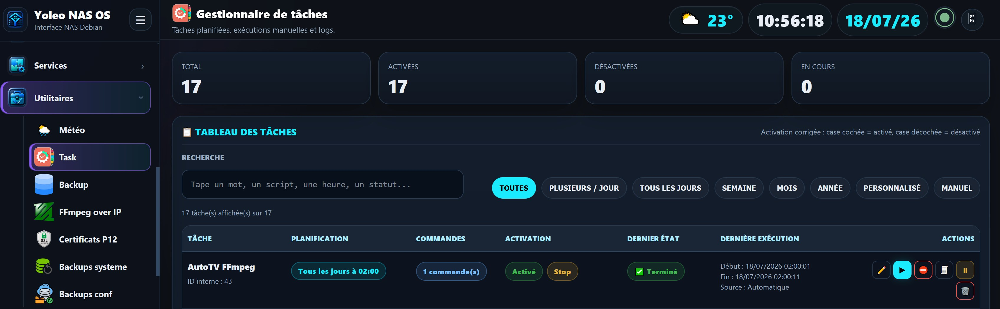

Le gestionnaire de tâches sert à programmer les scripts et commandes du NAS,
à lancer une tâche manuellement et à consulter son historique dans les
journaux. Chaque navigateur ou téléphone peut s'abonner une seule fois aux
notifications Web Push. Lorsqu'une tâche a l'option **Notification succès**,
Yoleo prévient les appareils abonnés quand elle se termine correctement ; une
fin en erreur peut également déclencher une alerte. L'abonnement est propre au
navigateur et peut être testé ou supprimé depuis cette page.

### Services et personnalisation

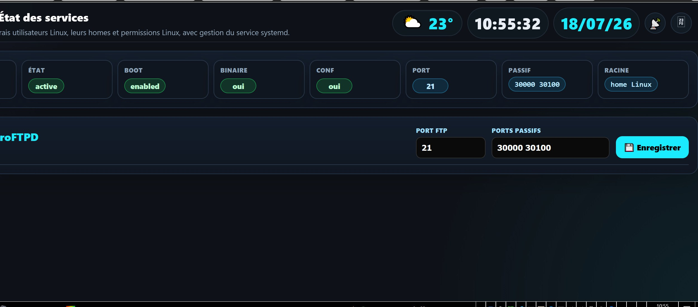

Yoleo regroupe l'administration des services NFS, Samba, SFTP, FTP et
multimédia, avec leur état systemd et leurs principaux paramètres. L'interface
peut également être personnalisée, du menu jusqu'à l'apparence de l'écran de
connexion.

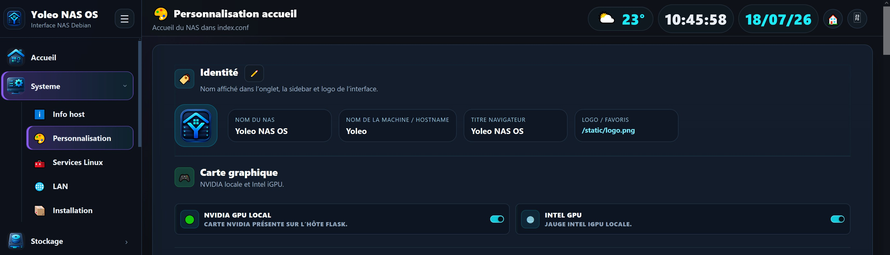

### Utilisation sur Android : application ou PWA

L'application Android fournie dans `appli/android/` est facultative. L'interface
web de Yoleo est aussi une **PWA** (Progressive Web App) : depuis Chrome sur
Android, ouvrez l'adresse du NAS, affichez le menu du navigateur puis choisissez
**Installer l'application** ou **Ajouter à l'écran d'accueil**. Yoleo apparaît
alors avec son logo parmi les applications et s'ouvre dans une fenêtre dédiée,
sans qu'il soit nécessaire d'installer l'APK.

La PWA reste l'interface web servie directement par le NAS : une mise à jour de
Yoleo côté serveur est donc disponible sans réinstaller l'application sur le
téléphone. Les notifications du gestionnaire de tâches utilisent le service
worker et l'abonnement Web Push du navigateur ; Chrome demandera l'autorisation
la première fois que l'utilisateur les active.

## API native pour créer d'autres applications

Yoleo ne se limite pas à l'interface web et aux applications fournies dans ce
dépôt. Il expose une **API JSON versionnée sous `/api/v1`**, accompagnée d'un
contrat technique détaillé : **[consulter la documentation complète de l'API](system/API.txt)**.

Un autre développeur peut donc créer sa propre application Android, Windows,
Linux ou son propre tableau de bord. Il peut reprendre seulement les fonctions
qui l'intéressent, proposer une interface différente ou réaliser un client
mobile plus complet que l'application actuelle. L'application officielle est
un exemple d'utilisation de l'API, pas une limite imposée au projet.

### Ce que l'API permet déjà

- tester la disponibilité du NAS et découvrir les capacités réellement prises
  en charge par la version installée ;
- obtenir en une seule requête un instantané de surveillance : système, CPU,
  mémoire, réseau, températures, ventilateurs, GPU, stockage et montages ;
- afficher l'état des services, conteneurs Docker, machines virtuelles, partages
  Samba, tâches, sauvegardes et constructions d'images ;
- démarrer ou arrêter des conteneurs, le service Docker, des machines virtuelles,
  des tâches planifiées et des sauvegardes, uniquement à travers des actions
  explicitement autorisées ;
- parcourir les volumes NAS, créer des dossiers, renommer, copier, déplacer ou
  supprimer des éléments dans les racines autorisées ;
- envoyer et télécharger des fichiers, télécharger un dossier sous forme de ZIP
  et produire un catalogue récursif avec empreintes SHA-256 pour contrôler les
  transferts ou développer une fonction de synchronisation.

La route `/api/v1/capabilities` permet à une application de ne présenter que
les fonctions disponibles. Les clients doivent ignorer les nouveaux champs
JSON qu'ils ne connaissent pas, ce qui permet à l'API d'évoluer sans casser les
applications existantes.

### Sécurité de l'API

L'accès distant est conçu autour de plusieurs protections complémentaires :

1. une connexion HTTPS avec vérification normale du certificat du serveur ;
2. un certificat client P12 contrôlé par le proxy en mTLS ;
3. une authentification du compte Linux avec PAM ;
4. un jeton Bearer indépendant et révocable pour chaque appareil.

Le mot de passe n'est pas conservé par l'API et les jetons sont stockés côté
serveur uniquement sous forme d'empreinte SHA-256. Les actions exposées sont
placées sur des listes blanches : l'API n'accepte pas de commande shell libre,
et les opérations dangereuses de suppression de conteneur ou de VM ne sont pas
ouvertes arbitrairement aux applications.

Pour développer un client, commencez par lire [`system/API.txt`](system/API.txt),
appelez `/api/v1/health`, authentifiez l'appareil, puis interrogez
`/api/v1/capabilities`. Le document décrit les routes, les exemples JSON, les
codes d'erreur stables, le stockage sécurisé recommandé sur Android et Windows,
ainsi que les règles à respecter pour contribuer de nouvelles fonctions.

<details>
<summary><strong>Voir la galerie complète des 34 captures</strong></summary>

#### Stockage et système

- [Tableau de bord](docs/images/dashboard.jpg)
- [Vue générale des disques](docs/images/disk-overview.jpg)
- [Identifiants de disque anonymisés](docs/images/disk-identifiers.jpg)
- [Pool de stockage](docs/images/storage-pool.jpg)
- [Profils mergerfs](docs/images/mergerfs.jpg)
- [Ramdrive](docs/images/ramdrive.jpg)
- [Installation](docs/images/installation.jpg)

#### Docker et construction d'images

- [Conteneurs Docker](docs/images/docker-containers.jpg)
- [Variables d'environnement Docker](docs/images/docker-environment.jpg)
- [Stacks Compose](docs/images/docker-stacks.jpg)
- [Images Docker](docs/images/docker-images.jpg)
- [Docker Run](docs/images/docker-run.jpg)
- [Éditeur Docker Compose](docs/images/docker-compose.jpg)
- [Construction d'images](docs/images/image-builds.jpg)
- [Registre de conteneurs](docs/images/container-registry.jpg)

#### Administration, partage et sauvegarde

- [Gestionnaire de fichiers](docs/images/file-manager.jpg)
- [Utilisateurs Linux](docs/images/users.jpg)
- [Utilisateurs Samba](docs/images/samba-users.jpg)
- [Partages NFS](docs/images/nfs-shares.jpg)
- [Service MiniDLNA](docs/images/minidlna-service.jpg)
- [État des services](docs/images/service-dashboard.jpg)
- [Service SFTP](docs/images/sftp-service.jpg)
- [Tâches planifiées](docs/images/scheduled-tasks.jpg)
- [Scripts de sauvegarde](docs/images/backup-jobs.jpg)
- [Sauvegardes système](docs/images/backup-system.jpg)
- [Sauvegardes de configuration](docs/images/backup-configuration.jpg)
- [Certificats P12](docs/images/certificates.jpg)
- [FFmpeg à distance](docs/images/ffmpeg-remote.jpg)

#### Machines virtuelles et interface

- [Machines virtuelles](docs/images/virtual-machines.jpg)
- [Stockage des VM](docs/images/vm-storage.jpg)
- [Paramètres d'une VM](docs/images/vm-settings.jpg)
- [Connexion](docs/images/login.jpg)
- [Personnalisation générale](docs/images/personalization.jpg)
- [Personnalisation du menu](docs/images/menu-personalization.jpg)

</details>

## Organisation du dépôt

- `system/` : serveur web Flask et interface d'administration du NAS ;
- `scripts/` : scripts principaux d'archive, cache, Docker, registre et stacks ;
- `bin/` : outils binaires complémentaires lorsqu'ils sont nécessaires ;
- `appli/android/` : application Android de supervision et de contrôle ;
- `appli/windows/` : agent Windows Yoleo.

## Installation simple avec l'image ISO

Pour un nouvel utilisateur, il n'est pas nécessaire de télécharger les dossiers
du projet un par un ni de compiler le code.

### 1. Télécharger Yoleonas NAS

**[Télécharger l'image ISO Yoleonas NAS Gen1](https://github.com/sftpmalin/Yoleonas/releases/latest/download/debian-13.4.0-amd64-nas-gen1.iso)**

[Télécharger le fichier de contrôle SHA-256](https://github.com/sftpmalin/Yoleonas/releases/latest/download/debian-13.4.0-amd64-nas-gen1.iso.sha256)

### 2. Créer la clé USB

Copiez l'image ISO sur une clé USB avec un logiciel de création de clé
amorçable, puis démarrez le futur NAS sur cette clé.

### 3. Installer le système

Suivez l'installation affichée à l'écran. Une fois l'installation terminée,
retirez la clé USB et redémarrez la machine.

> **Projet en cours de développement :** l'installation du système de base est
> simplifiée, mais certaines fonctions avancées, notamment le réseau des
> machines virtuelles et le réseau LAN des conteneurs Docker, demandent encore
> une configuration manuelle expliquée ci-dessous.

[Voir toutes les versions et tous les fichiers publiés](https://github.com/sftpmalin/Yoleonas/releases)

## Ce qui fonctionne avec le réseau Linux par défaut

Après l'installation, le NAS peut utiliser directement la connexion réseau
Linux standard pour l'administration et les fonctions de base. Il n'est pas
obligatoire de modifier immédiatement le réseau pour découvrir l'interface et
commencer à utiliser le serveur.

En revanche, dans l'état actuel du projet, la préparation des réseaux avancés
n'est pas encore automatique :

- les machines virtuelles ne peuvent pas utiliser correctement le pont LAN tant
  que le bridge Linux `br0` n'a pas été installé ;
- les conteneurs qui doivent apparaître directement sur le réseau local ne
  peuvent pas utiliser le réseau Docker externe `br0` tant que celui-ci n'a pas
  été créé ;
- les conteneurs Docker utilisant seulement les réseaux Docker classiques
  (`bridge`, `host`, etc.) ne sont pas concernés de la même manière.

Cette étape manuelle est une limite connue de la version actuelle, et non une
panne de Docker ou des machines virtuelles.

## Activer le réseau des machines virtuelles

Le script `scripts/system/lan_bro.sh` transforme la carte réseau physique en
port du bridge Linux `br0`. L'adresse IP principale du NAS est alors portée par
`br0`, ce qui permet aux machines virtuelles de rejoindre le réseau local.

### Vérifier avant de modifier

```bash
cd /chemin/vers/Yoleonas
sudo bash scripts/system/lan_bro.sh -show
```

La commande ci-dessus affiche la carte, l'adresse, la passerelle et la
configuration détectées sans rien modifier.

### Installer le bridge `br0`

> **Attention :** cette commande modifie la configuration réseau persistante et
> redémarre le NAS. Une session SSH ou l'interface web peuvent être interrompues.
> Exécutez-la de préférence avec un accès local à l'écran et au clavier du NAS,
> et notez auparavant son adresse IP, sa passerelle et ses serveurs DNS.

```bash
sudo bash scripts/system/lan_bro.sh -install
```

Après le redémarrage, contrôlez le résultat :

```bash
sudo bash scripts/system/lan_bro.sh -statut
```

Pour revenir à la configuration réseau classique sauvegardée par le script :

```bash
sudo bash scripts/system/lan_bro.sh -remove
```

Cette commande redémarre également le NAS.

## Activer le réseau LAN des conteneurs Docker

Le script `scripts/system/lan_docker.sh` détecte automatiquement le réseau du
NAS et crée un réseau Docker externe nommé `br0`, utilisant le pilote `ipvlan`
en mode L2.

Vérifiez d'abord l'état actuel :

```bash
cd /chemin/vers/Yoleonas
sudo bash scripts/system/lan_docker.sh status
```

Créez ensuite le réseau Docker :

```bash
sudo bash scripts/system/lan_docker.sh install
```

Si la détection automatique choisit une mauvaise interface, indiquez la carte
réseau manuellement, par exemple :

```bash
sudo bash scripts/system/lan_docker.sh install enp1s0
```

Les fichiers Compose qui utilisent ce réseau doivent le déclarer comme réseau
externe :

```yaml
networks:
  br0:
    external: true
```

Contrôlez enfin la configuration :

```bash
docker network ls
docker network inspect br0
```

Le bridge Linux des VM et le réseau Docker portent tous les deux le nom `br0`,
mais ce sont deux configurations distinctes. Selon l'usage du NAS, il peut être
nécessaire d'installer l'une, l'autre ou les deux.

## Première installation

Clonez le dépôt puis entrez dans son dossier :

```bash
git clone https://github.com/sftpmalin/Yoleonas.git
cd Yoleonas
```

Avant la première installation, créez la référence locale d'intégrité. Cette
commande génère automatiquement le dossier `init`, le catalogue
`init/system.sha256` et l'archive `init/system.tar.gz` à partir des fichiers
présents sur la machine :

```bash
sudo bash system/system.sh -add
```

Lancez ensuite l'installation du service :

```bash
sudo bash system/system.sh -install
```

L'ordre est important :

1. `-add` crée le catalogue et l'archive de référence dans `init`.
2. `-install` installe l'application et son service Linux.

Après `-install`, le service systemd est activé pour démarrer automatiquement
avec Linux, puis il est lancé immédiatement.

Le dossier `init` est volontairement généré localement et n'est pas stocké sur
GitHub, afin de ne pas gonfler inutilement le dépôt. Le dossier `offline` est
également facultatif : s'il n'existe pas, `system.sh` télécharge les dépendances
Python nécessaires depuis Internet.

## Commandes de `system.sh`

Le script `system/system.sh` installe, démarre et protège l'interface Yoleonas.
Les commandes d'administration doivent être lancées avec `sudo`.

| Commande | Fonction |
| --- | --- |
| `sudo bash system/system.sh -add` | Crée ou met à jour la référence d'intégrité dans `init` : catalogue SHA-256 et archive locale des dossiers présents parmi `system`, `scripts`, `offline` et `bin`. À exécuter avant la première installation, puis après une modification volontaire des fichiers protégés. |
| `sudo bash system/system.sh -install` | Installe les paquets Debian nécessaires, crée l'environnement Python, installe les dépendances, génère la clé secrète locale, crée le service systemd, l'active au démarrage de Linux et le lance. |
| `sudo bash system/system.sh -start` | Démarre le service Yoleonas déjà installé. |
| `sudo bash system/system.sh -stop` | Arrête le service. |
| `sudo bash system/system.sh -restart` | Vérifie l'intégrité des fichiers puis redémarre le service. |
| `sudo bash system/system.sh -status` | Affiche l'état du service, ses chemins et son port réseau. |
| `sudo bash system/system.sh -logs` | Affiche les derniers journaux systemd et le fichier de log. |
| `sudo bash system/system.sh -routes` | Vérifie le chargement de l'application Flask et affiche ses routes. |
| `sudo bash system/system.sh -integrity` | Contrôle les fichiers protégés et restaure ceux qui ont été modifiés ou supprimés à partir de l'archive `init`. |
| `sudo bash system/system.sh -backup` | Crée dans `init/backups` une sauvegarde datée des dossiers protégés présents. |
| `sudo bash system/system.sh -restaure` | Propose les sauvegardes disponibles, restaure celle choisie, puis reconstruit la référence d'intégrité. |

### Après une mise à jour volontaire

Le contrôle d'intégrité considère toute modification non enregistrée comme
anormale. Après avoir volontairement modifié ou mis à jour les fichiers du
projet, validez la nouvelle version de référence avec :

```bash
sudo bash system/system.sh -add
sudo bash system/system.sh -restart
```
